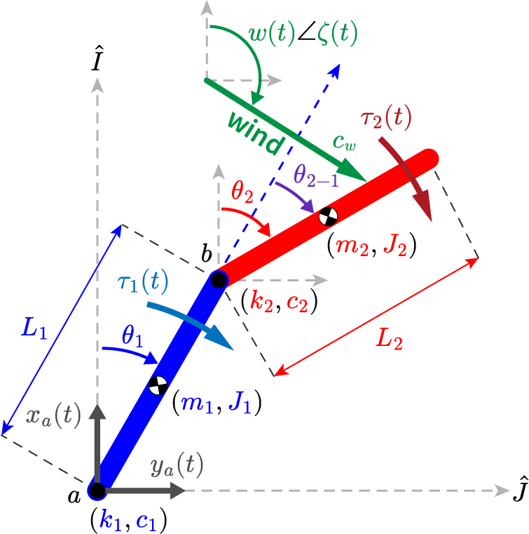
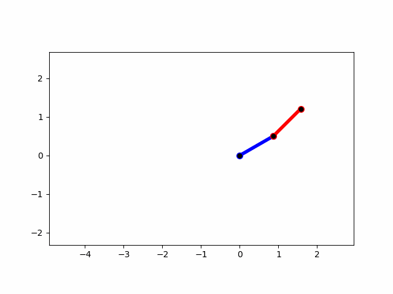

# free-forced-double-pendulum
Derivation and simulation, and control of the dynamics of a rigid-body double pendulum with a moving base, control torques, and an external wind force. 

## Model overview
The model consists of a 2 DOF double pendulum, where the DOF are defined as the segment angles $\theta_1$ and $\theta_2$, respectively, in the global reference frame. The base of the first pendulum segment is defined by a time-varying position $\mathbf{r}_a = [x_a, y_a]$ that is modeled as an input (not a DOF).

Each segment is modeled as a rigid-body with a length $L_\bullet$, mass $m_\bullet$, mass $m_\bullet$ and inertia $J_\bullet$. Additionally, each segment junction has a torsional stiffness $k_\bullet$ and damping $c_\bullet$. Torques acting on each segment $\tau_\bullet$ are also included to allow the module to be controlled, if desired. An external wind vector $\mathbf{w} = w \angle \zeta$ is modeled to create a force vector acting on the COM of each segment via damping $c_w$.

## Model derivation
The dynamics equations of motion are derived symbolically via Lagrangian mechanics in a MATLAB Live Script:
[dynamics/free_forced_rigid_double_pendulum_with_wind_dynamics.mlx](dynamics/free_forced_rigid_double_pendulum_with_wind_dynamics.mlx)

The derivation code is designed to be easily modifiable. If one wishes to change certain model properties (for instance make damping proportion to velocity squared, etc.) the code can be modified and re-run.

## Model simulation & control
The final output of the derivation code is the nonlinear state-space equations required to simulate the model, which be copy-pasted for use with an ODE solver.

This repository makes use of the ***pybounds*** Python package (https://github.com/vanbreugel-lab/pybounds) to simulate and control the derived dynamics. It is recommended to install pybounds from source:

    pip install pandas
    pip install do-mpc
    pip install git+https://github.com/vanbreugel-lab/pybounds

## Example simulations
Example simulations are provided as Jupyter notebooks
### Simple open-loop 
Include gravity, but no damping or springs

[example_open_loop.ipynb](examples/example_open_loop.ipynb)

### With model predictive control

Precisely control the movement of the base, and the 1st segment angle, but leave the 2nd segment able under open-loop control. Damping and springs are on.

### With model predictive control + wind

Keep the base and 1st segment angle constant and let the wind move the 2nd segment. Damping and springs are on.

